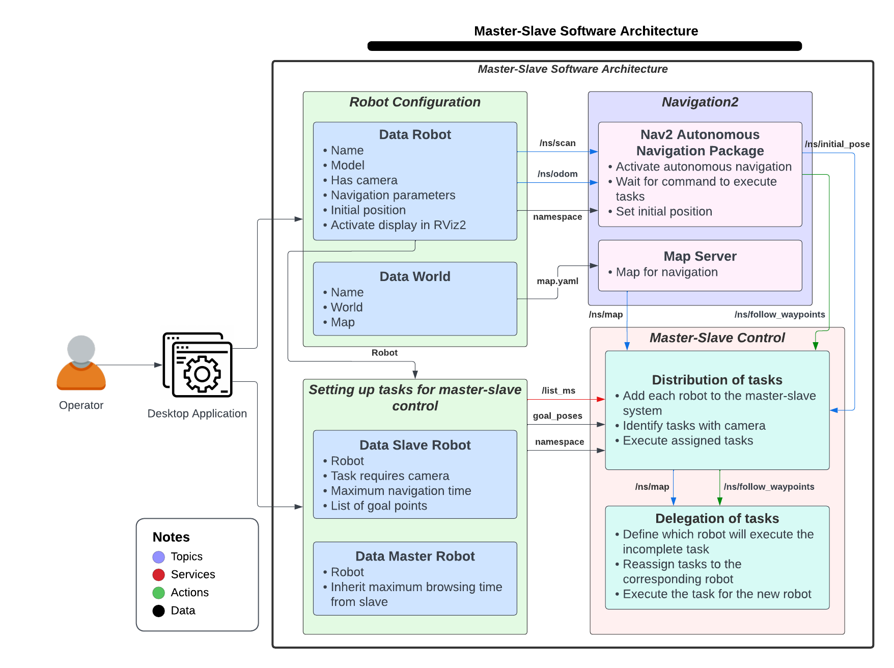
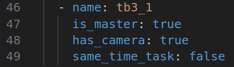
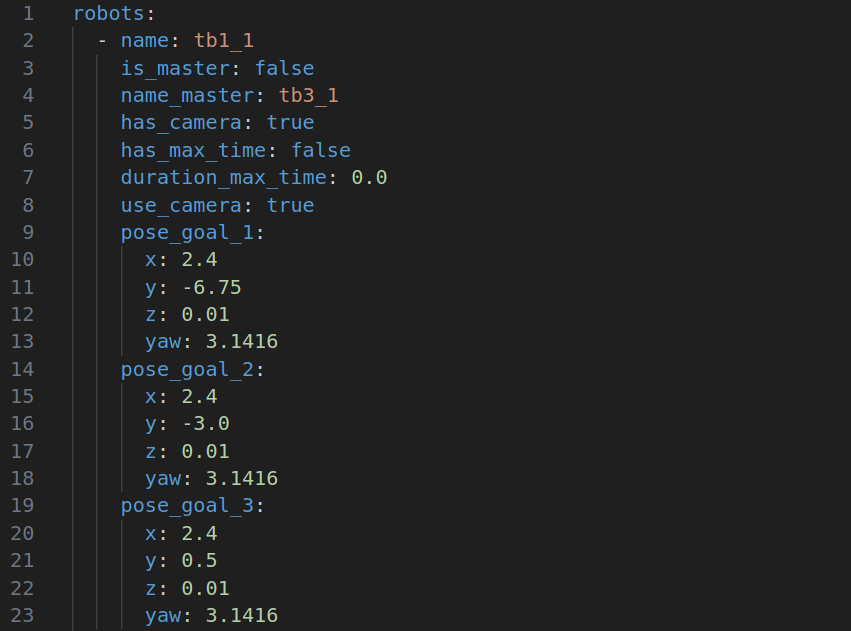

<h1 align="center">
  Software Architecture Master-Slave
</h1>

The development included the use of UGVs and ROS2 Humble, applying object-oriented programming techniques and robust design patterns. The results confirmed that, under the master-slave structure, the system completes all assigned tasks, even in the event of failure of one or more robots. In addition, an intuitive desktop application was designed, which facilitates the operation of the system without the need for specialized knowledge in ROS2. The proposed architecture is shown to be effective for managing and delegating tasks in terrestrial multirobot systems, establishing a solid foundation for future research. 

## Software Architecture

<p align="center">
   
</p>

## Installation

Create a workspace

```bash
  mkdir -p ~/ros2_ws/src
  cd ~/ros2_ws/src
```

Clone this repository

```bash
  git clone https://github.com/iesusdavila/master_slave_mrs.git
```
    
Build the workspace with colcon
```bash
  cd ~/ros2_ws
  colcon build
```

## Configuration Master Slave

You can config multiple master-slave structures, there is no limitation on the number of robots.

### Input parameters for the master

For the master we have to enter the following parameters:​

- Name of the robot
- Indicates if it is the master
- Has a camera
- Inherits navigation time from slaves

<p align="center">
   
</p>

### Input parameters for the slaves

For slave we need to enter the following parameters:​

- Name of the robot
- Indicates if it is the master
- Name of the master
- Has a camera
- Has maximum navigation time
- Maximum navigation time
- Task requires camera
- List of points for tasks

<p align="center">
   
</p>

## Deployment

To deploy this project run

```bash
  ros2 run multi_robot_master_slave nav_master_slave.py <path_to_yaml_file>
```

<p align="center">
   
</p>

## Authors

- [@iesusdavila](https://github.com/iesusdavila)
- [@cesarq19](https://github.com/Cesarq19)
